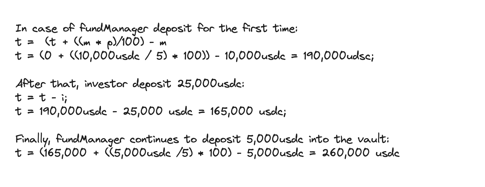
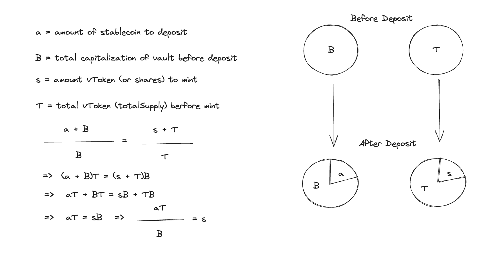
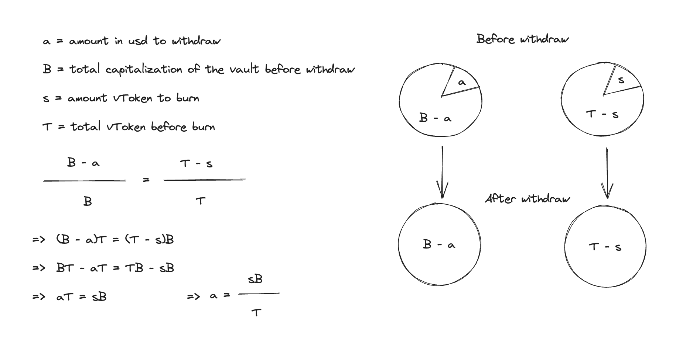
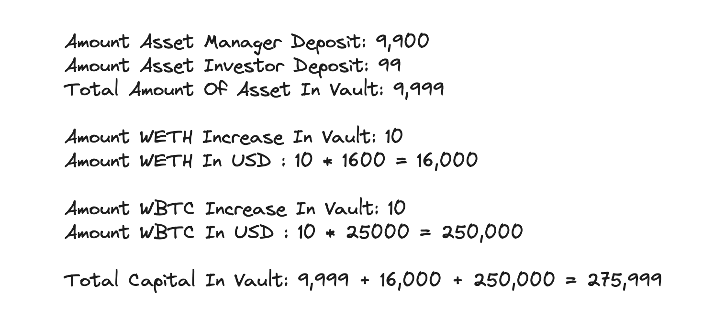
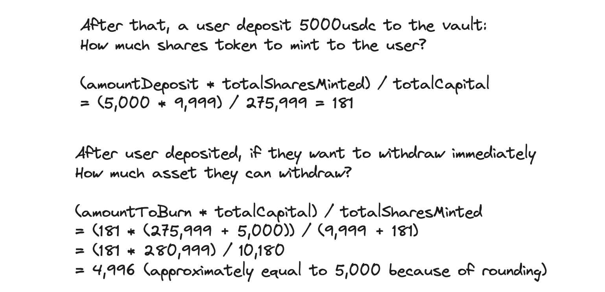
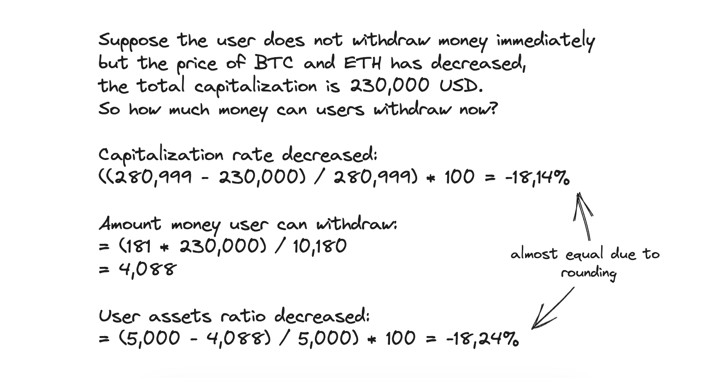
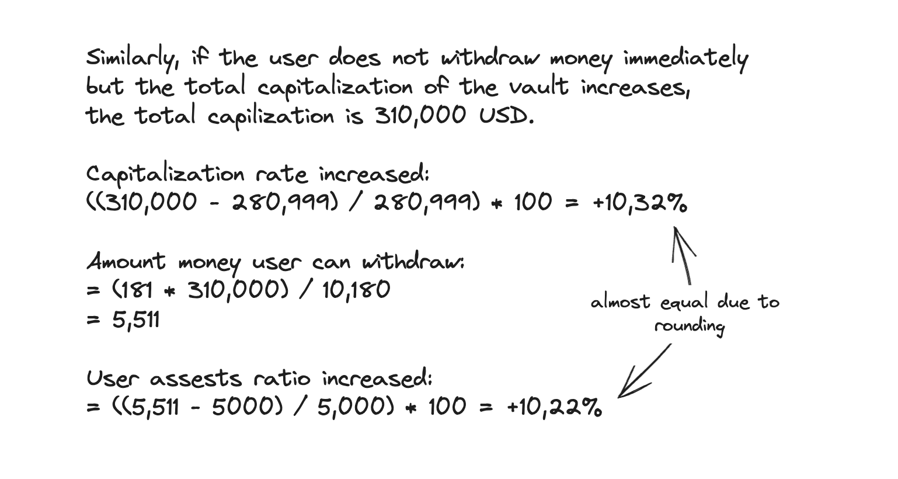

# Transfund

This project aims to help any individual or organization create and operate an open fund. Individual participants are divided according to the profits that the entire fund has.
## About 

The idea is to rely on the features that ERC4626 brings, creating an open protocol that takes advantage of the decentralized element of DeFi to:
  - Anyone can create and manage a fund, and call for people to participate in their fund.
  - Anyone can invest in an open fund with public fund parameters, profits and losses.

Leverage and connect with other DeFi protocols like DEX, Lending Market, Staking or provide liquidity to a Liquidity Pools. However, in the final version when summiting this project at ETHGlobal I did not have enough time to do everything in my idea, I only focused on building the logic for Fund Vault.

I did not create a project or protocol to compete with DEXs, AMMs, Lending Pools, etc. Because in fact, DeFi projects on the current market such as Uniswap or Aave have done so well. And to build a project to compete with it is very difficult. With this project, I want to take advantage of the benefits that DeFi protocols offer.

## Benefit

### Who will benefit if this protocol is operational in the future?
- Organizations and individuals who want to build their own investment fund. I call these Fund Managers.
- Those who want to invest their money in DeFi protocols but are tired of having to learn about DeFi protocols, or having to monitor market fluctuations. I call these Investors.

In this section, I will talk about the benefits of investors first.

### What is the benefits of investors?

The idea of this project came up when I saw a friend of mine, who is a very good crypto investor. Another investor messaged my friend asking that they would send money to my friend and my friend would take 20% of the total profit earned by the investor who sent my friend the money to invest. It's like a form of passive investment.

However, I always have this thought: What will happen when I send money to someone to invest on my behalf, but instead of them using my money for investment, they simply take the entire amount and run away with the money they've deceived?

To answer my question, I built this protocol to minimize the risk of investing in hedge funds, even those hedge funds with only one manager.

In the traditional investment market, if you want to invest in a particular fund or give your money to someone to invest on your behalf, you are required to send your money to that organization or individual. The only thing that makes you trust that your money will not be lost is the reputation of that individual or organization.

In this project, I leverage the strengths of blockchain technology to create a protocol that connects investment funds and investors, in a peer-to-peer and decentralized manner.

Investors have the option to choose a fund they trust for investment, with parameters that they can select, including the participation fee percentage and the profit-sharing percentage.

All these parameters are set by the fund manager from the beginning, and they cannot change their settings to ensure fairness for the entire protocol.

Investors can withdraw their funds at any time they wish based on the percentage of shares they hold in the vault.

Additionally, when participating in a Fund Vault, users can see the percentage of shares owned by the fund manager of that vault. This is set by the Fund Manager to build their credibility. For example, if the fund manager sets the `_ownerSharesPercentage` to 10%, then the total assets they have in the protocol must be 10%. If they want to manage a fund worth $100,000, they must have $10,000 in the fund. If the total fund amount reaches $100,000, the owner must deposit additional assets into the fund to increase this total. Of course, the Fund manager can set this percentage to 0%, and the choice of which fund to invest in is up to the investors.

### What is the benefits of fund managers?

What I'm taking full advantage of here is decentralization. Here, any individual or organization can open their own fund and manage it. They seek profits by managing their funds to participate in DeFi protocols such as Uniswap, Aave, and more. In this current version submitted to ETHGlobal, I haven't built a DAO for the protocol. However, in the future, if there is a DAO, the protocol can increase its credibility by requiring DAO approval when deploying a Fund Vault on the protocol. The protocol's manager will have to rely on the DAO's voting results to determine whether or not to allow Fund Managers to open a fund.

There will be two types of benefits that well-performing fund managers will receive. These are the participation fee and profit-sharing.

- Participation fee (is `_feeBasisPoints` in the contract): This is the percentage of the total amount that a investor will have to pay to the fund manager when participating in any fund, and this amount will be immediately sent to the fund manager's wallet address. 

For example, if a fund manager sets the `_feeBasisPoint` at 1%, when an investor deposits $10,000 into the fund managed by that fund manager, they would have to pay $100 to the fund manager.

Of course, fund managers can also set the participation fee to 0 to attract more participants into their fund, thereby increasing the overall fund capital.

- Profit-sharing (is `divideProfits` in the contract): This is the percentage of the total profit that investor will receive when they withdraw their funds from the fund.

For example, if a fund manager sets the `_divideProfits` at 20%, and a investor invests and earns $100, when they withdraw their entire amount from that fund, they would have to pay the fund manager $20.

Just like the participation fee, the profit-sharing will also be set by the fund manager to manage their fund.

Both the participation fee and profit-sharing cannot be changed throughout the fund management process and will be publicly disclosed, ensuring transparency of the fund.

Based on the concept of this project, most of it can be deployed to interact with all EVM-compatible chains. This will also be a significant benefit for investors and fund managers because they can freely choose the chains they desire.

### What the benefits of the other DeFi Protocols?

If this project can operate successfully in the future and connect with DeFi protocols, allowing fund managers to optimize their investment choices, for example, by diversifying their portfolio into DEX, staking, and providing liquidity to liquidity pools, I believe that a significant liquidity pool can help other DeFi protocols to further develop.

Because many investors want to put their money into the market but may not have extensive knowledge of the crypto market, they also find it challenging to get acquainted with and access DeFi protocols like Uniswap or Aave. The only thing they need to do is create a non-custodial wallet for themselves and find a reputable vault. Then, they can invest their money in the fund, and if there's a profit generated by a fund manager, they can benefit from it as well.

### What the benefits of the owner of this project?
When building a DeFi project, I always aim for all stakeholders to benefit from participating in my project. I've discussed the benefits for investors, fund managers, and other projects in the crypto ecosystem. Now, let's consider the benefits for the project developers themselves.

In the `FundVault` contract, there is no function to directly connect with other DeFi protocols. What I want is for `FundVault` to interact with other DeFi protocols through the Engine contract. This can be beneficial because the project owner can charge fees for creating new fund vaults, fees for interacting with other DeFi protocols, or even a portion of the profit generated by FundVault. However, these fees should not be excessively high.

The entire revenue of the project can be used to continue building and upgrading the Engine for the protocol. Connecting with various DeFi protocols and different chains, expanding the project's reach, and ultimately creating value for token investors if the protocol develops in the future.

## FundVault

Initially, my plan had nothing to do with ERC4626. However, after struggling for a while to find a solution for profit sharing with investors when the vault is profitable, I accidentally stumbled upon ERC4626, and it was like an oasis in the desert as I developed this project.

In addition to the basic features of ERC4626, I have made improvements and added some HOOKs.

The features of FundVault include:

Allowing Fund Managers to choose the initial settings, including `_asset` (the type of asset to set for the vault, such as USDC or DAI), `_feeBasisPoint` (the initial fee percentage when investors join the Vault), `_ownerSharesPercentage` (the percentage of shares owned by the owner), and `_divideProfits` (the percentage of profits if investors have them and withdraw from the vault) provides a high degree of customization and control for fund managers. This flexibility allows them to tailor their funds to meet specific investment strategies and goals.

- The ability for Fund Managers to set the `_asset` to either USDC or DAI provides an initial choice, and the potential to expand to additional asset types through DAO voting in the future offers a dynamic and community-driven approach to asset selection within the vault. This flexibility can adapt to changing market conditions and investor preferences.
- The flexibility of setting `_feeBasisPoint` to any value, including 0, allows Fund Managers to decide how they want to structure the initial fee. For example, setting it to 100 would represent a 1% initial fee. When a new user joins the Vault, the assets are transferred directly to the Fund Manager's wallet address, as defined by this fee structure. This provides Fund Managers with the freedom to design their fee model as they see fit.
- The `_ownerSharesPercentage` serves as a commitment from the Fund Manager to the investors. For example, if a Fund Manager sets their share percentage in the Vault at 10%, when they deposit 10,000 USDC into the vault, the vault can receive a maximum of 190,000 USDC from investors. This approach helps the Fund Manager share their risk in the Vault and build trust with investors by demonstrating their commitment to the fund's success. It aligns the interests of the Fund Manager with those of the investors. 
- The `_divideProfits` parameter defines the percentage of profits that investors will share. If a fund vault has been operational for a while and is profitable, when an investor withdraws their portion, they will be required to share a predetermined percentage of their profits with the fund manager. This setting ensures that investors and fund managers have a clear agreement on how profits are distributed, creating transparency and trust in the process.

The `_afterDeposit` function is a critical feature that allows for the calculation and determination of when both the Fund Manager and the investor deposit additional funds into the vault to increase the vault's ratio. This function helps manage the vault's capital inflow and ensures that the predefined ratios and percentages are maintained as more funds are added to the vault. It enables the fund to adjust to changing circumstances and maintain the intended balance between the Fund Manager and the investors.

Here's an example of how the ratio can be increased in the Vault:

- The initial setup by the Fund Manager for the Vault is as follows: `_asset` = USDC, `_feeBasisPoint` = 100 (1%), `_ownerSharesPercentage` = 5 (5%).

- Initially, if the Fund Manager doesn't deposit any funds into the Vault, users cannot deposit because right from the start, the Fund Manager has committed to minting 5% of the total shares for the entire project.

- The Fund Manager decides to deposit 10,000 USDC, in accordance with the initial commitment of 5%. Now, they will be able to manage a fund with a total value of 200,000 USDC, and users can deposit 95% of the total Vault.

Formula for this: First, let's set the variables as follows:

t = total shares can mint

m = new manager shares minted

p = manager shares percentage

i = investor deposited amount

To calculate how many vTokens (or shares) will be minted when a user deposits into the vault, we will use the formula below:

To calculate how many tokens will be withdrawn from the vault (here it can be stablecoins or other tokens, here I want to calculate the total amount in USD). We will have the formula below to calculate for that.

Here's a full example of how FundVault works using the formula:

Of course, the above example does not include calculating fees like `_feeBasisPoint` and `_divideProfits`, but just defaults these values to 0.

## Features not implemented yet

Honestly, I didn't realize that the project submission deadline was on the 22nd. I started coding on the 14th, focusing on the logic, and this prevented me from fully showcasing what my idea could achieve in the final submission for ETHGlobal. I mistakenly thought that the 27th was the submission deadline because I had previously participated in a hackathon, Web3Hackfest, which didn't include a separate judging day.

### Connect with other DeFi protocols

This is what I really want to do the most beyond the core of the protocot. But really, one is I don't have enough time, two is I don't have enough knowledge to connect with DeFi protocols such as Uniswap and Aave. but I still have to learn about them. I have learned about Uniswap but did not have enough time to deploy it to the final version to submit this project.

### DAO for protocols
The integration of DAO is indeed an important feature in the protocol. DAO can make the deployment of FundVaults more challenging for larger funds or for those seeking community verification. However, it's still possible to create FundVaults without going through the DAO. Vaults created through the DAO are generally considered more reputable and trusted by investors, as they come with an added layer of community validation. This flexibility allows for a range of fund structures within the protocol, accommodating different preferences and needs.

### Back-end Server (Offchain)
I plan to use a backend server to listen to events from the Vault, store vault information, and reduce unnecessary calls to smart contracts, thereby improving the performance of the dApp.

### Mask Network
I think it would be good if the protocol deployed together with Mask Network, where fund managers can share their personal information to increase credibility.

